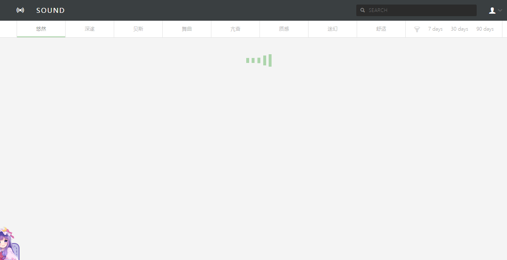
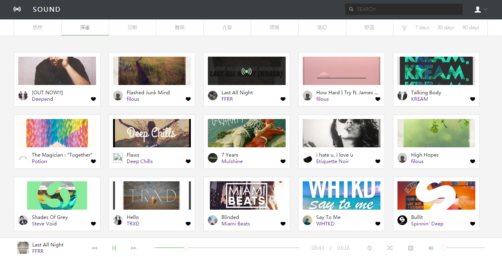

# SoundCloud

> 用Vue/Vuex写的SoundCloud客户端，SoundCloud资源不好用了，准备换网易云的试试。

## 使用

```
1. npm install

2. npm run dev

3. visit http://localhost:8082/

```
## 截图


## 功能

### 已实现的功能
* 播放、暂停
* 上一曲
* 下一曲
* 进度控制
* 自动播放
* 分类
* 状态变化
* 音量控制

### 待实现的功能
* 播放列表
* 详情页
* 移动端

## Dependencies

* [SoundRedux](https://github.com/andrewngu/sound-redux)
* [vue-infinite-scroll](https://github.com/ElemeFE/vue-infinite-scroll)
* [500px](https://github.com/500px/api-documentation)
